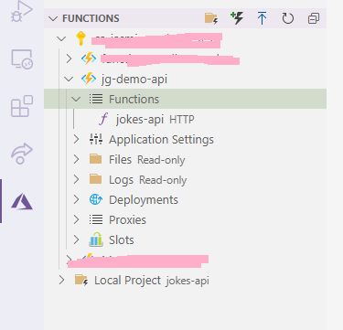

# Joke Generator

[HTTP Azure Function](https://docs.microsoft.com/en-us/azure/azure-functions/functions-bindings-http-webhook?&WT.mc_id=academic-0000-jasmineg) that returns random jokes. [Based off this version built in JavaScript](https://github.com/alexweininger/joke-api)

## Run locally via Command Line

1. Install  [Azure Functions Core Tools](https://docs.microsoft.com/azure/azure-functions/functions-run-local?tabs=windows,csharp,bash&WT.mc_id=academic-0000-jasmineg#install-the-azure-functions-core-tools)

2. Clone this repository and navigate to its directory in your favorite command line tool

3. In the command line run the following

        `jokes-api > func start`

4. You should see something like this:

    ```
    Now listening on: http://0.0.0.0:7071
    Application started. Press Ctrl+C to shut down.

    Functions:

            jokes-api: [GET,POST] http://localhost:7071/api/jokes-api

    For detailed output, run func with --verbose flag.
    [2021-01-22T19:06:20.689] Worker process started and initialized.
    ```

5. Test it out with [Postman](#testing-a-local-function)

## Deploy to Azure via VS Code

_FYI: There are MANY ways to deploy a function to Azure, you can find more info [here](https://docs.microsoft.com/azure/azure-functions/functions-deployment-technologies?WT.mc_id=academic-0000-jasmineg#deployment-methods)_

1. Open your local copy in VS Code

2. Install the [Azure Function Extension](https://marketplace.visualstudio.com/items?itemName=ms-azuretools.vscode-azurefunctions&WT.mc_id=academic-0000-jasmineg)

2. In the Explorer, right click in the root directory and select `Deploy to Function App...`

3. Follow the prompts that pop up at the top of the editor 
    - ⚠ You may be asked to sign in to your Azure account first

4. You should see a "Deploying to [your function app name]" notification, and will changes to "Deployment to [your function app name] completed" when finished.

5. Open the Azure Extension and search for your function app at [your function app name]. Confirm the `jokes-api` function exists
    - ⚠ If not, try deploying again to [your function app name]

6. Right click on the `jokes-api` function and select `Copy function Url`

7. Test it out with [Postman](#testing-a-deployed-function)


### It should look something like this:



## Testing with Postman

Postman makes it easy to send POST/GET/etc requests to endpoints, perfect for HTTP triggered functions! Download it here: [Postman download page](https://www.postman.com/downloads/)

### Testing a Local Function
- In Postman, click `Import` and find the collection in the repo named `AzureSamples.postman_collection.json` [found here](AzureSamples.postman_collection.json)
- In the AzureSamples, collection open `Local - JokesAPIRequest`
- Confirm that the url matches the one from step 4
    - ⚠ if they're not the same use the url that was generated on your machine!
- Click `Send`

### Testing a Deployed Function

- In Postman, click `Import` and find the collection in the repo named `AzureSamples.postman_collection.json` [found here](AzureSamples.postman_collection.json)
- In the AzureSamples, collection open `JokesAPIRequest`
- Paste the copied url from step 7, replacing the placeholder url
- Click `Send`


### It should look something like this:


📖 [Learn more about Azure Functions](https://docs.microsoft.com/en-us/azure/azure-functions/functions-overview?WT.mc_id=academic-0000-jasmineg)
👩🏿‍🏫 [Microsoft Learn Modules on Azure Functions](https://docs.microsoft.com/en-us/learn/browse/?terms=azure%20functions&WT.mc_id=academic-0000-jasmineg)