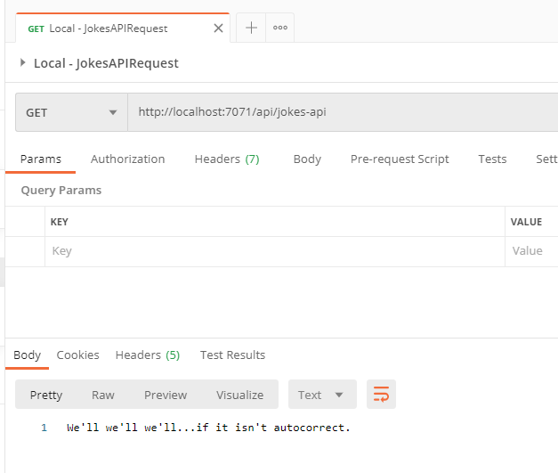

# Joke Generator

HTTP Azure Function that returns random jokes.

## Run locally via Command Line

1. Intall  [Azure Functions Core Tools](https://docs.microsoft.com/en-us/azure/azure-functions/functions-run-local?tabs=windows%2Ccsharp%2Cbash#install-the-azure-functions-core-tools)

2. Clone this repository and navigate to its directory in your favorite command line tool

3. In the command line run the following

        `jokes-api > func start`

4. You should see something like this:

    ```
    Now listening on: http://0.0.0.0:7071
    Application started. Press Ctrl+C to shut down.

    Functions:

            jokes-api: [GET,POST] http://localhost:7071/api/jokes-api

    For detailed output, run func with --verbose flag.
    [2021-01-22T19:06:20.689] Worker process started and initialized.
    ```

5. Test it out with [Postman](https://www.postman.com/downloads/)
    - In Postman, Import the collection named `AzureSamples.postman_collection.json`
    - In the AzureSamples, collection open `Local - JokesAPIRequest`
    - Confirm that the url matches the one from step 4
        - ⚠ if they're not the same use the url that was generated on your machine!
    - Click `Send`


It should look something like this:



## Deploy to Azure
